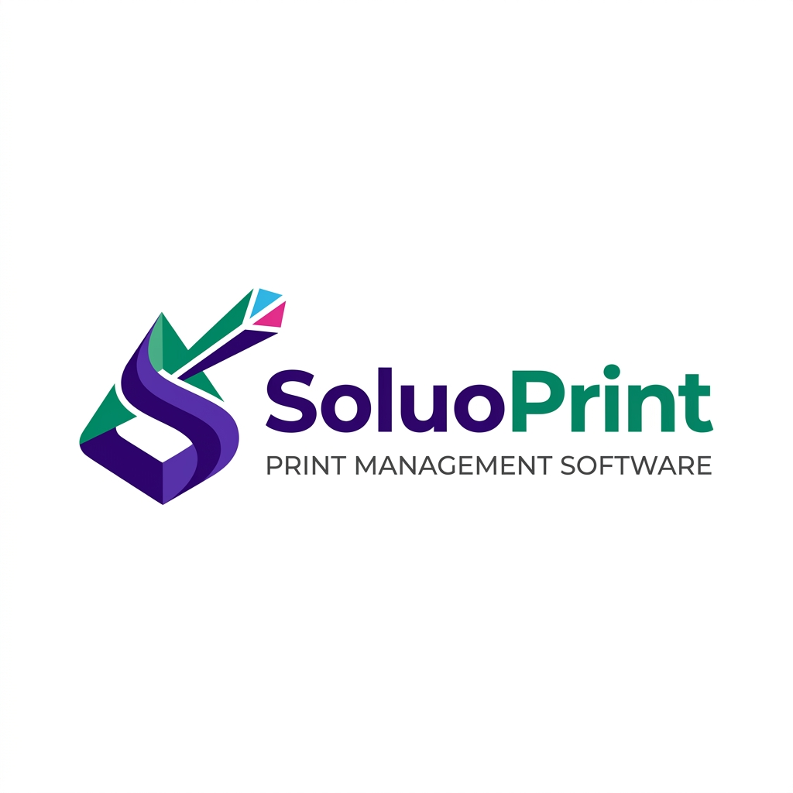

# SoluoPrint | Ultimate Print Shop Management System

SoluoPrint is a premium, all-in-one management platform designed specifically for modern print shops and digital studios. It streamlines the entire production workflow—from customer intake and job tracking to financial reporting and role-based access control.

## 🚀 Key Features

### 📦 Production & Job Management
- **Dynamic Job Tracking**: Monitor the status of every print job (Pending, In Progress, Completed, Overdue).
- **Custom Dimension Pricing**: Automatically calculate costs based on width, height, and unit (ft, inch, cm, m).
- **Service Categories**: Categorize services (Large Format, Digital Print, Branding) with custom pricing models.
- **Assigned Workflow**: Assign specific jobs to team members for better accountability.

### 👥 Customer Relationship Management (CRM)
- **Centralized Directory**: Manage all customer information, contact details, and order history.
- **Credit & Balance Tracking**: Instantly see which customers owe money and their total lifetime value.
- **SMS Notifications**: Integrated communication to keep customers updated on their job status.

### 💰 Financial & Accounting Tools
- **Payment Collection**: Record payments across multiple accounts (Cash, Bank, Mobile Money).
- **Expense Tracking**: Log business overheads and material procurement to monitor net profit.
- **Receivables Management**: A dedicated dashboard for tracking outstanding debts and collecting payments.
- **Real-time Analytics**: Visualized financial performance through interactive charts and monthly/yearly summaries.

### 🔒 Security & Access Control
- **Custom Profile-Based Auth**: Independent login system utilizing the `profiles` table for maximum flexibility.
- **Granular Permissions (RBAC)**: Define roles (Admin, Sales, Production, Reception) and restrict access to sensitive financial data or settings.
- **Repair Login Utility**: Admin tool to sync and fix user credentials instantly.

### 📈 SEO & Professional Branding
- **Dynamic Meta Tags**: Every page features unique SEO-friendly titles and descriptions for better indexing.
- **Premium UI/UX**: A sleek, dark-mode-ready interface built with modern typography and smooth animations.
- **Custom Identity**: Fully branded with dynamic logos, favicons, and Open Graph images.

## 🛠️ Technology Stack

- **Frontend**: [React 18](https://reactjs.org/) + [Vite](https://vitejs.dev/)
- **Backend/Database**: [Supabase](https://supabase.com/) (PostgreSQL)
- **Routing**: [React Router 6](https://reactrouter.com/)
- **Icons**: [Lucide React](https://lucide.dev/)
- **Charts**: [Chart.js](https://www.chartjs.org/)
- **State Management**: React Context API
- **SEO**: [React Helmet Async](https://github.com/staylor/react-helmet-async)

## 💎 Business Benefits

1. **Efficiency**: Reduce manual paperwork and eliminate errors in price calculations.
2. **Transparency**: Get a 360-degree view of your business health through the automated dashboard.
3. **Debt Recovery**: Never lose track of a payment again with the automated Receivables tracking.
4. **Data Security**: Keep your staff focused on their tasks while protecting your financial records via strict role permissions.
5. **Professionalism**: Impress customers with professional receipts, SMS updates, and a fast, modern system.

## 📦 Deployment

SoluoPrint is optimized for standard hosting environments. It includes a custom `.htaccess` file for seamless integration with **cPanel/Apache** servers.

---
Developed with ❤️ by the SoluoPrint (Peter Borngreat-Mensah - ID: 22424679).
